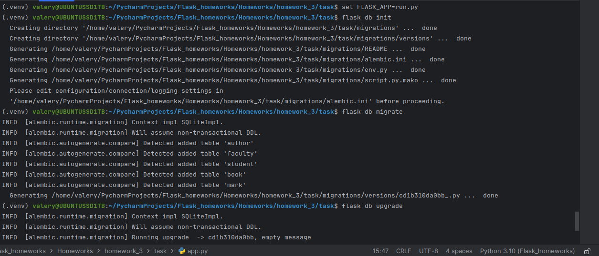
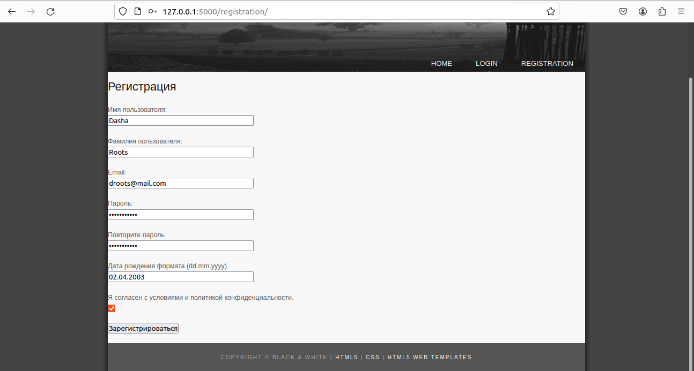
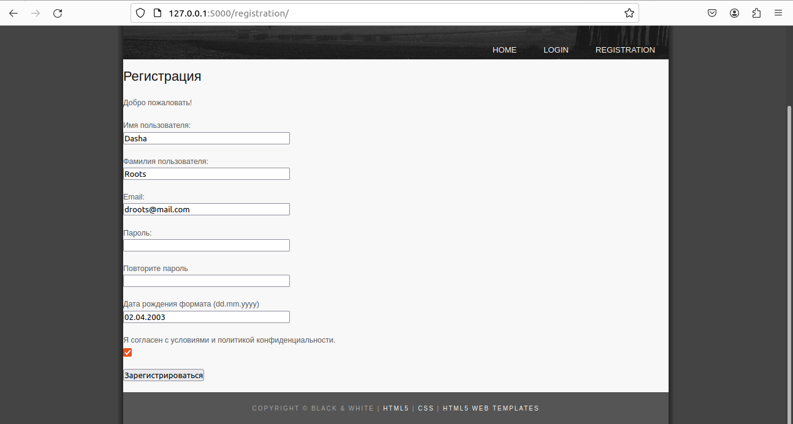
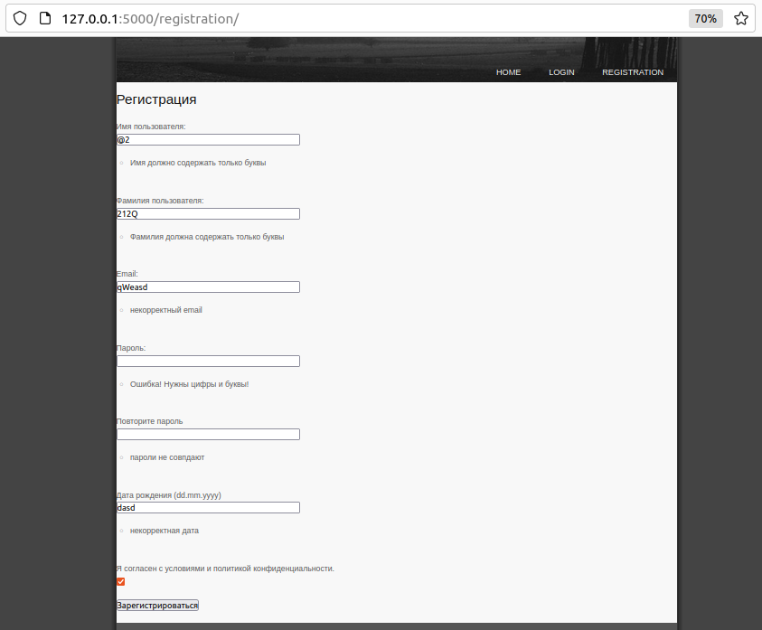
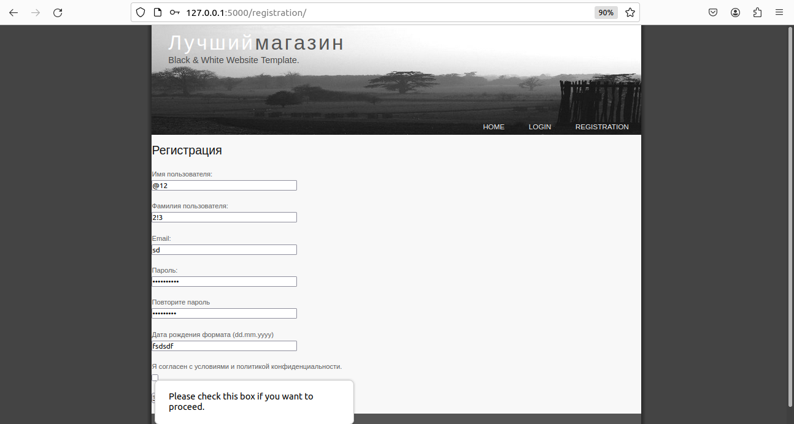
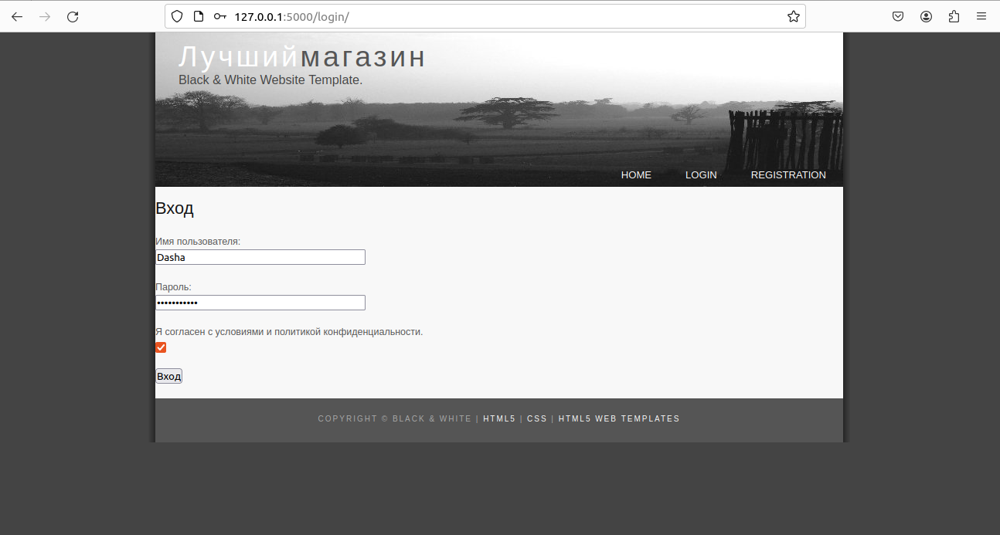
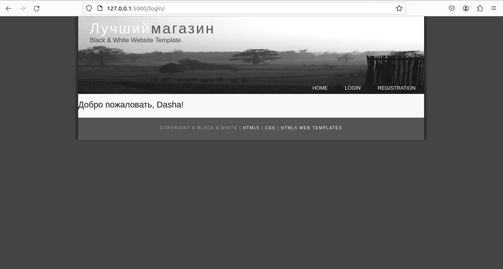
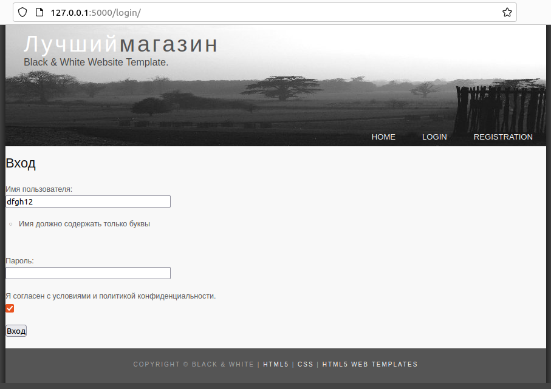
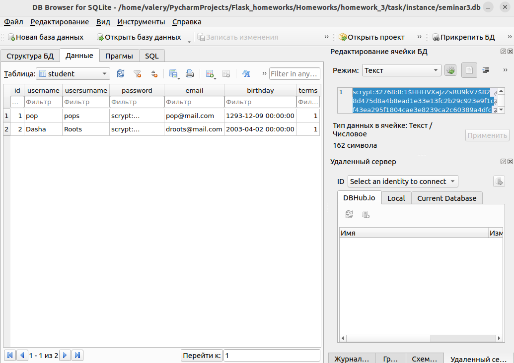

### 6, 7, 8 задания здесь объединены в одну
### Страница 'Вход' для тех, кто есть в базе данных
### Страница 'Регистрация' для тех, кого еще нет в базе
* Все поля проверяются на валидность, все должны быть заполнены
* пароль шифруется, и должен содержать не менее 8 символов, цифры и буквы 
* при подтверждении пароля они должны совпадать
* почта должна быть валидной 
* дата должна быть корректной и не быть из будущего(мы не в фильме)
## Миграции

## Регистрация, страница registration

## Успешная регистрация, появилось: 'Добро пожаловать!'

## невалидные данные регистрация

## не нажата галочка terms

## Вход, проверка. страница login

## Успешный вход, страница приветствия

## невалидные данные входа

## База данных, зашифрованный пароль

