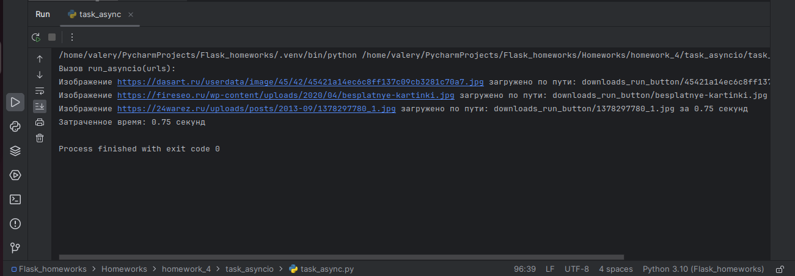

### Самое сложное было найти сайты с требуемым адресом изображения

### 3 папки task_asyncio, task_multiprocessing, task_threading
### каждая папка соответствует своему подходу.
### внутри каждой папки имеются по 2 папки downloads
* 1 downloads_command_line
* 2 downloads_run_button

### В первую папку сохраняются изображения при запуске из командной строки
### Во вторую папку сохраняются изображения при запуске в IDE кнопкой либо в командной строке без передачи аргументов,
### тогда скрипт возьмёт аргументы из списка urls...

## Асинхронный подход, результат выполнения:
### Нажатие кнопкой run

### Запуск из терминала

## Многопроцессорный подход, результат выполнения:
### Нажатие кнопкой run

### Запуск из терминала

## Многопоточный подход, результат выполнения:
### Нажатие кнопкой run

### Запуск из терминала

