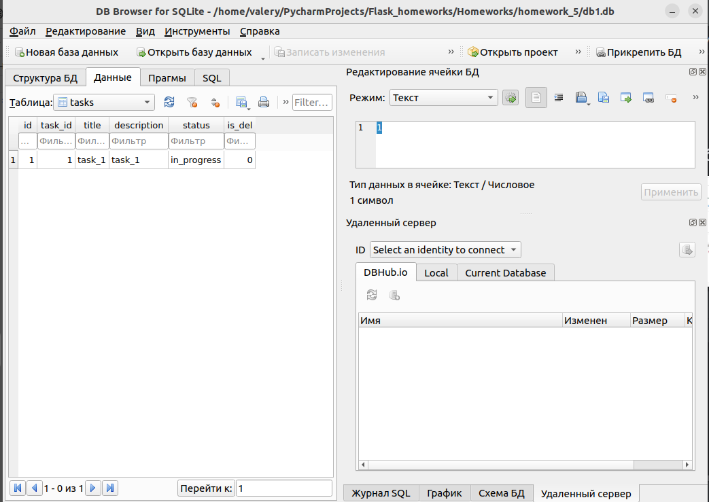
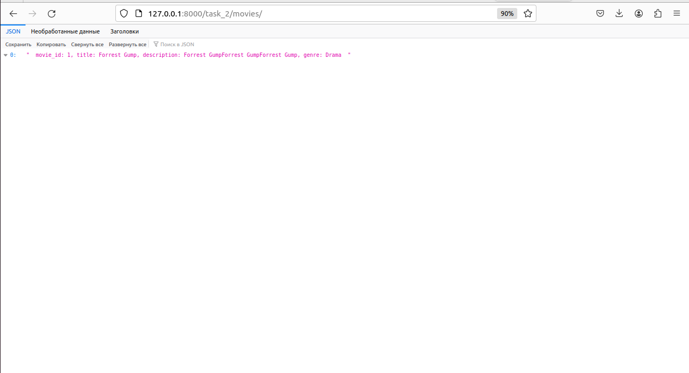
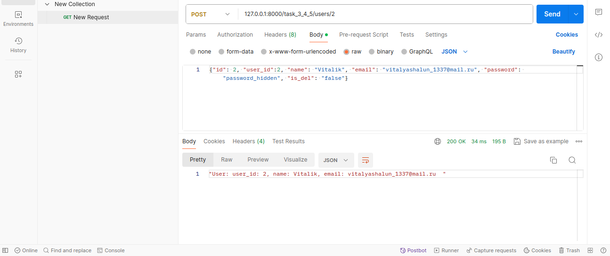
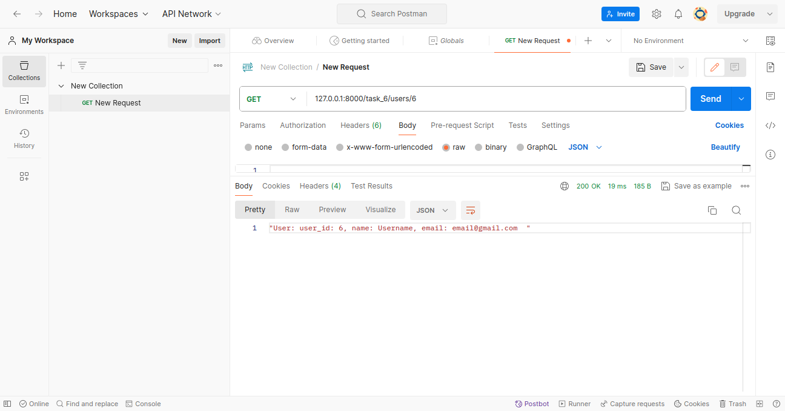

# task_1:
### POST запрос, добавил запись

### База данных после POST запроса, добавилась запись

### GET запрос, посмотрел записи, который я добавил POST-ом

### DELETE запрос, удалил запись

### GET запрос, посмотрел список после удаления

### PUT запрос, через постман изменил некоторые данные

### База данных, проверил результат изменений

# task_2
### GET запрос, посмотрел список фильмов

### GET запрос, через постман выбрал жанр драма

### POST запрос, через постман добавил пятый элемент

### База данных, сходил, проверил на месте ли фильм

### PUT запрос, через постман изменил фореста гампа

### Delete запрос, удалил я фореста

### База данных, проверил отсутствие фореста на месте

# task_3_4_5:
### GET запрос, посмотрел записи юзеров

### GET запрос, посмотрел запись конкретного юзера

### База данных до изменений

### POST запрос, добавил нового юзера

### База данных после POST добавления юзера

### PUT запрос, изменил данные NewUser

### База данных после PUT новый юзер стал старым

### DELETE запрос. Добавил POST-ом юзера dupe, потом удалил

# task_6:
### pycharm попросил установить python-multipart

### multipart установлен

### GET запрос в браузере, так как у нас jinja-обработка html

### GET запрос в postman, так как у нас jinja-обработка html postdata перенаправит нас на другую страницу и покажет юзеров

### GET запрос в postman, вывод конкретного юзера

### База данных перед POST на создание юзера

### POST запрос создания юзера

### База данных после POST запросa создания юзера

### POST запрос в браузере, заполяем поля

### POST запрос в браузере, заполяем поля

### После кнопки add new user страница обновилась и появился в таблице новый юзер

### Запрос PUT, заменили dupe на new_dupe

### База данных, изменили данные dupe, теперь он new_dupe

### DELETE запрос, он надоел, удалили

### База данных лишилась недостойного new_dupe

# task_7:
### GET запрос списка тасков

### GET запрос конкретного таска по id

### POST запрос создание нового таска через постман

### База данных, новый такс появился

### PUT запрос в постман, изменили данные 7 таска

### База данных, проверили изменения в таск 7

### DELETE запрос, удалили таск 7

### База данных, проверили удаление таск 7

# task_8:
### GET запрос списка тасков

### GET запрос конкретного таска в постман

### POST запрос создание нового таска

### База данных, проверили добавление таска

### POST запрос создание нового таска без id, тогда он ищет первый свободный  шв

### База данных, в таблице был свободен id 4

### PUT запрос, изменили таск с id 4 и task_id 5

### База данных, проверили изменения

### DELETE запрос, ну и удалили его наконец

### База данных, проверили, что удалили тот самый

