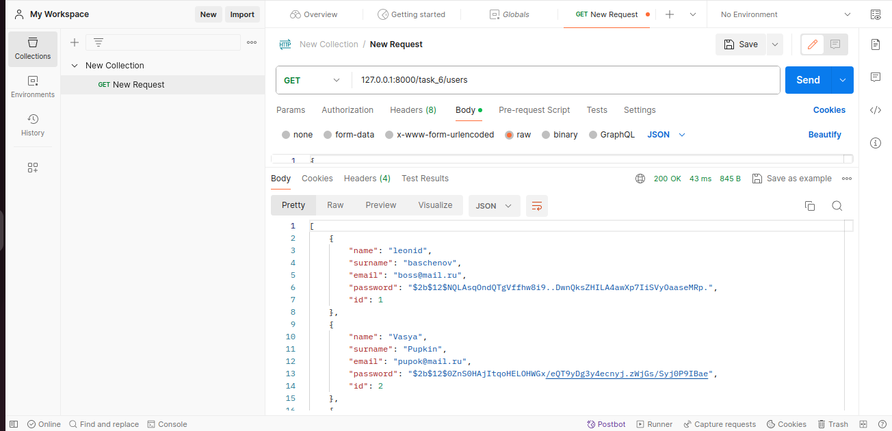

## Создалась база данных и таблицы в ней:

## все запросы кратко:

## все запросы подробно:

### ○ 1 Чтение всех юзеров

### ○ 2 Чтение одного юзера

### ○ 3 запись юзера

### ○ 4 Изменение юзера
### БД

### БД

### ○ 5 Удаление юзера

### ○ 6 Чтение всех товаров

### ○ 7 Чтение одного товара

### ○ 8 Запись товара

### БД

### ○ 9 Изменение товара

### БД

### ○ 10 Удаление товара

### БД

### ○ 11Чтение всех заказов

### ○ 12 Чтение одного заказа

### ○ 13 Запись заказа

### БД

### ○ 14 Изменение заказа

### БД

### ○ 15 Удаление заказа

### БД
